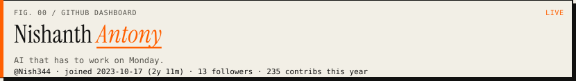
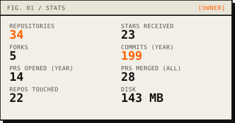
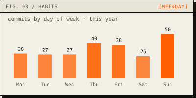
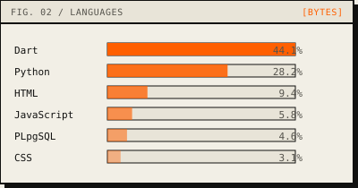
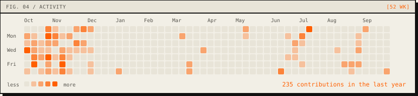
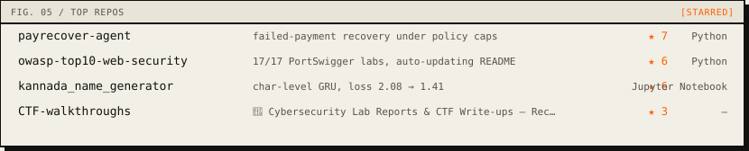

<!--
  Generated dashboard — python3 scripts/generate.py
  Palette: paper #F2EFE6 / ink #111110 / accent #FF5F00 (nishanthantony.dev)
  Stats cached in assets/github_stats.json · refreshed by Actions
-->

<picture>
  <source media="(prefers-color-scheme: dark)" srcset="assets/header-dark.svg"/>
  
</picture>

  <a href="https://nishanthantony.dev/"><code>portfolio</code></a>
  ·
  <a href="https://nishanthantony.dev/resume.pdf"><code>resume</code></a>
  ·
  <a href="mailto:nishanthantony5@gmail.com"><code>email</code></a>
  ·
  <a href="https://www.linkedin.com/in/nishanth-antony-b60110289/"><code>linkedin</code></a>
  ·
  <a href="https://leetcode.com/u/Nish345/"><code>leetcode</code></a>

<table width="100%">
  <tr>
    <td width="50%" valign="top">
<picture>
  <source media="(prefers-color-scheme: dark)" srcset="assets/stats-dark.svg"/>
  
</picture>
 
<picture>
  <source media="(prefers-color-scheme: dark)" srcset="assets/habits-dark.svg"/>
  
</picture>
    </td>
    <td width="50%" valign="top">
<picture>
  <source media="(prefers-color-scheme: dark)" srcset="assets/languages-dark.svg"/>
  
</picture>
    </td>
  </tr>
</table>

<picture>
  <source media="(prefers-color-scheme: dark)" srcset="assets/activity-dark.svg"/>
  
</picture>

<picture>
  <source media="(prefers-color-scheme: dark)" srcset="assets/repos-dark.svg"/>
  
</picture>

---

Lab dashboard · safety orange <code>#FF5F00</code> · data from GitHub API · updated 2026-10-08
· <a href="https://nishanthantony.dev/">nishanthantony.dev</a>

