<!--
  N.A.lab profile README — generated from data.json
  Run: python3 scripts/generate.py
  Do not hand-edit SVG assets; edit data.json instead.
-->

<picture>
  <source media="(prefers-color-scheme: dark)" srcset="assets/banner-dark.svg"/>
  
</picture>

<picture>
  <source media="(prefers-color-scheme: dark)" srcset="assets/terminal-dark.svg"/>
  
</picture>

<sub><i>← this README is a recording. the live shell is on nishanthantony.dev</i></sub>

[`ls projects`](#projects) [`cat about.md`](#about) [`skills`](#skills) [`notebook`](#notebook) [`contact`](#contact) [`open portfolio`](https://nishanthantony.dev/)

---

<a id="projects"></a>

## Projects

### `$ ls projects`

6 entries. each states the problem, the approach, the result, and what it cost me to learn.

<picture>
  <source media="(prefers-color-scheme: dark)" srcset="assets/div-projects-dark.svg"/>
  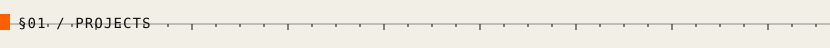
</picture>

<table>
<tr>
<td width="50%" valign="top">
<picture>
  <source media="(prefers-color-scheme: dark)" srcset="assets/card-grader-dark.svg"/>
  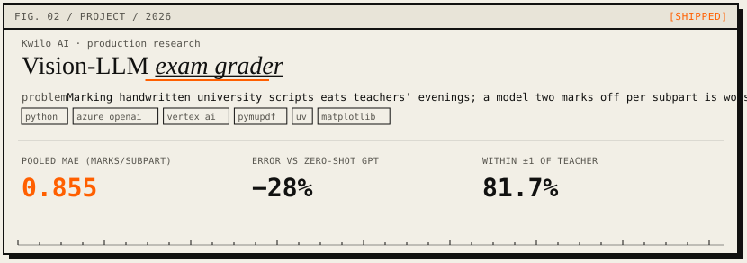
</picture>
<br/>
<sub><i>← 0.855 MAE = usually off by less than one mark</i></sub>
<p>
<strong>Problem.</strong> Marking handwritten university scripts eats teachers' evenings; a model two marks off per subpart is worse than no model.<br/>
<strong>Approach.</strong> Scanned PDF → page images → subpart map → vision LLM with rubric + few teacher exemplars. Benchmarked GPT-5.4 Mini, Gemini 3 Flash and 3.1 Pro over 4 subjects / 11 cells.<br/>
<strong>Result.</strong> Pooled MAE 0.855 marks/subpart; 81.7% within ±1 of the teacher; −28% error vs zero-shot GPT.<br/>
<strong>Lesson.</strong> Exemplars beat model size: few-shot Flash (0.890) beat zero-shot Pro (1.195). A harness that writes run manifests beats any single prompt tweak.<br/>
<a href="https://nishanthantony.dev/#p-grader">portfolio write-up -></a>
</p>

<details>
<summary>architecture</summary>
<br/>
<picture>
  <source media="(prefers-color-scheme: dark)" srcset="assets/arch-grader-dark.svg"/>
  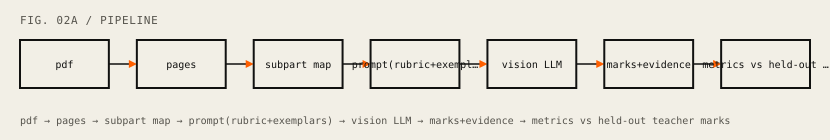
</picture>
</details>
</td>
<td width="50%" valign="top">
<picture>
  <source media="(prefers-color-scheme: dark)" srcset="assets/card-payrecover-dark.svg"/>
  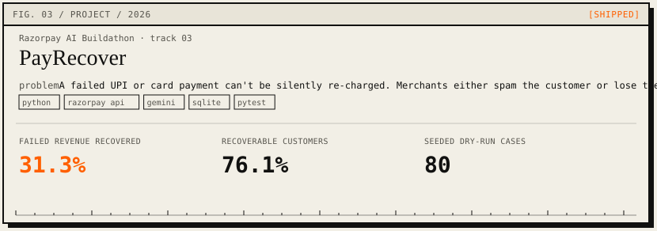
</picture>

<p>
<strong>Problem.</strong> A failed UPI or card payment can't be silently re-charged. Merchants either spam the customer or lose the sale.<br/>
<strong>Approach.</strong> Rules diagnose the failure; Gemini only sees ambiguous cases. Every action passes a policy gate (caps + kill switch) into an append-only audit log.<br/>
<strong>Result.</strong> 31.3% of failed revenue recovered (INR 44,205 of 141,353); 76.1% of recoverable customers captured across 80 seeded cases.<br/>
<strong>Lesson.</strong> The model call is the easy 10%. The agent is the policy around it: typed timeouts, writes that can't double-fire, a stop that stays stopped.<br/>
<a href="https://github.com/Nish344/payrecover-agent">repo -></a> · <a href="https://www.youtube.com/watch?v=ZIid1JJSooE">demo video -></a>
</p>

<details>
<summary>architecture</summary>
<br/>
<picture>
  <source media="(prefers-color-scheme: dark)" srcset="assets/arch-payrecover-dark.svg"/>
  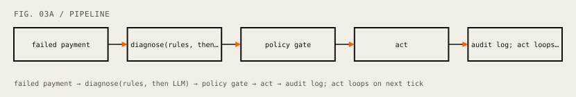
</picture>
</details>
</td>
</tr>
<tr>
<td width="50%" valign="top">
<picture>
  <source media="(prefers-color-scheme: dark)" srcset="assets/card-kwilo-dark.svg"/>
  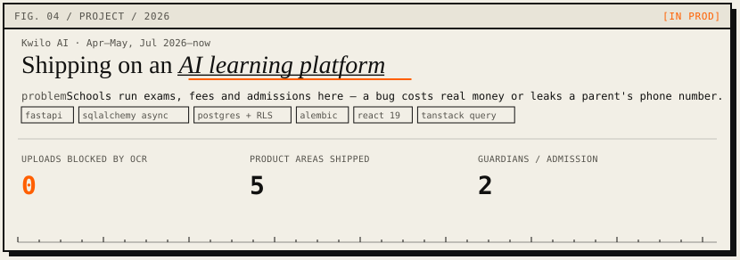
</picture>

<p>
<strong>Problem.</strong> Schools run exams, fees and admissions here — a bug costs real money or leaks a parent's phone number.<br/>
<strong>Approach.</strong> Answer sheets auto-matched (filename → header OCR, never blocking upload). Blog stack end-to-end. Race-safe fee installments. Admissions with primary guardian + A4 form.<br/>
<strong>Result.</strong> 0 uploads blocked when OCR fails; 5 product areas shipped; 2 guardians/admission with one as parent login.<br/>
<strong>Lesson.</strong> A self-reported phone number is not proof of identity. Lock the row before two payments settle the same installment milliseconds apart.<br/>
<a href="https://kwilo.ai">kwilo.ai -></a>
</p>

</td>
<td width="50%" valign="top">
<picture>
  <source media="(prefers-color-scheme: dark)" srcset="assets/card-fediot-dark.svg"/>
  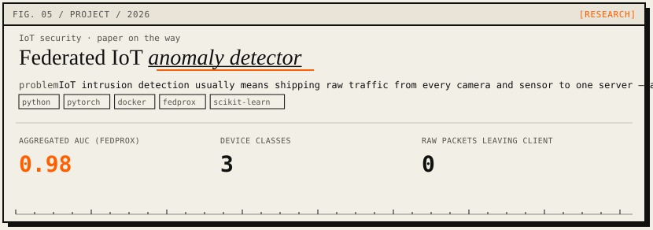
</picture>
<br/>
<sub><i>← 0.98 AUC arrived after fixing a shard bug, not after tuning</i></sub>
<p>
<strong>Problem.</strong> IoT intrusion detection usually means shipping raw traffic from every camera and sensor to one server — a privacy and bandwidth problem.<br/>
<strong>Approach.</strong> Dockerised federated clients (cameras, sensors, controllers); RFRE on IP/port features; FedAvg vs FedProx against spoofing and DDoS.<br/>
<strong>Result.</strong> Aggregated AUC 0.98 with FedProx; 3 device classes; 0 raw packets leave a client.<br/>
<strong>Lesson.</strong> Most 'model instability' was a data-partitioning bug. Check the shards before you tune the optimizer.<br/>
<a href="https://nishanthantony.dev/fediot-progress.pdf">progress report -></a>
</p>

<details>
<summary>architecture</summary>
<br/>
<picture>
  <source media="(prefers-color-scheme: dark)" srcset="assets/arch-fediot-dark.svg"/>
  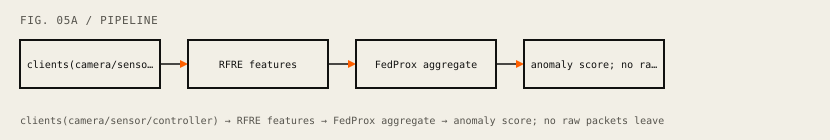
</picture>
</details>
</td>
</tr>
<tr>
<td width="50%" valign="top">
<picture>
  <source media="(prefers-color-scheme: dark)" srcset="assets/card-samudra-dark.svg"/>
  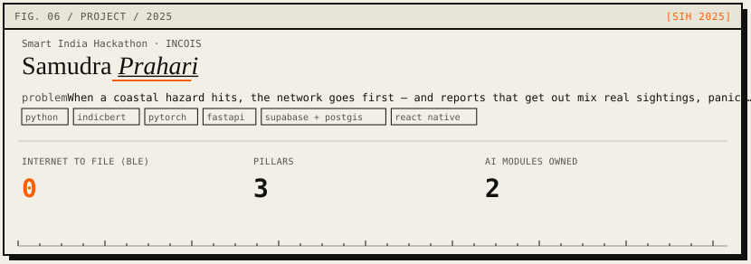
</picture>

<p>
<strong>Problem.</strong> When a coastal hazard hits, the network goes first — and reports that get out mix real sightings, panic, and recycled photos.<br/>
<strong>Approach.</strong> Offline BLE-mesh field reports + social scraper. Owned IndicBERT sentiment and image verification → confidence score per report on a PostGIS map.<br/>
<strong>Result.</strong> 0 internet needed to file via BLE mesh; 3 pillars (app / scraper / dashboard); 2 AI modules owned.<br/>
<strong>Lesson.</strong> Coastal posts mix English, Hindi and regional languages in one sentence. A report needs a confidence score before it reaches a map people act on.<br/>
<a href="https://github.com/nikhil-r0/samudra-prahari-ecosystem">source -></a> · <a href="https://www.youtube.com/watch?v=5G5odwkGp0A">demo video -></a>
</p>

<details>
<summary>architecture</summary>
<br/>
<picture>
  <source media="(prefers-color-scheme: dark)" srcset="assets/arch-samudra-dark.svg"/>
  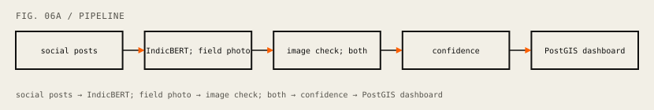
</picture>
</details>
</td>
<td width="50%" valign="top">
<picture>
  <source media="(prefers-color-scheme: dark)" srcset="assets/card-veris-dark.svg"/>
  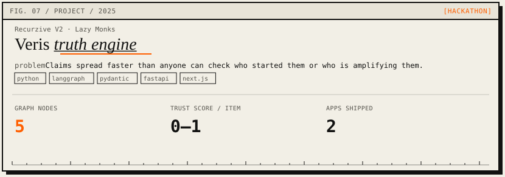
</picture>

<p>
<strong>Problem.</strong> Claims spread faster than anyone can check who started them or who is amplifying them.<br/>
<strong>Approach.</strong> LangGraph state machine: collector → verifier → graph builder → refiner (dig deeper or stop) → reporter.<br/>
<strong>Result.</strong> 5 graph nodes in the loop; trust score 0–1 per evidence item; agent API + Next.js UI.<br/>
<strong>Lesson.</strong> An agent loop needs an explicit stopping rule and typed shared state before it needs a better model. Pydantic on every edge kept the demo alive.<br/>
<a href="https://github.com/nikhil-r0/veris-ecosystem">repo -></a> · <a href="https://www.youtube.com/watch?v=OmviNm0HJbg&t=1s">demo video -></a>
</p>

<details>
<summary>architecture</summary>
<br/>
<picture>
  <source media="(prefers-color-scheme: dark)" srcset="assets/arch-veris-dark.svg"/>
  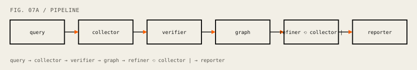
</picture>
</details>
</td>
</tr>
</table>

---

<a id="notebook"></a>

## Notebook

### `$ tail notebook.log`

<picture>
  <source media="(prefers-color-scheme: dark)" srcset="assets/div-notebook-dark.svg"/>
  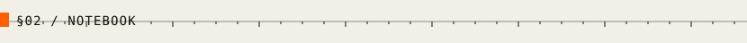
</picture>

<sub><i>← two notebook rows are failures. those taught me the most</i></sub>

| date | entry | tag | result |
| --- | --- | --- | --- |
| `2026-10` | w2v-BERT 2.0 vs Whisper-large encoders | `ML` | OOF `0.9346`, best so far. public LB didn't move; private split did. |
| `2026-09` | Fine-tuning Whisper-large on 826 clips | `ML` | lost to frozen probe, `0.904` vs `0.925`. overfits by epoch 5. |
| `2026-09` | Face-tracking water gun | `IOT` | MediaPipe face centre → pan/tilt → two ESP32 servos. shoot is still a stub. |
| `2026-07` | AssetFlow, 8-hour hackathon | `HACK` | owned asset track: registry, allocation state machine, transfers, overdue flagger. |
| `2026-05` | Gemini 3.1 Pro vs 3 Flash, zero-shot grading | `EVAL` | Flash wins File Structures by `0.42` MAE, loses Math by `0.54`. |
| `2026-05` | Sarvam document OCR as grading front-end | `EVAL` | benchmarked, then removed. documented why so nobody re-tries it blind. |
| `2026-04` | Kannada name generator, char-level GRU | `ML` | loss `2.08` → `1.41` over 10k epochs. mostly merely plausible. |
| `2025-12` | OWASP Top 10 lab series | `SEC` | `17/17` PortSwigger labs written up. README updates via Actions. |
| `2025-11` | DFA-based intrusion detection, from scratch | `SEC` | Snort-style rules → DFA + PCRE, TCP reassembly, live dashboard. |
| `2025-08` | REINFOSEC CTF sprint | `SEC` | `100+` challenges in 8 weeks. TryHackMe top `2%`. |
| `2024-10` | Green Terrace, BuzzOnEarth @ IIT Kanpur | `HACK` | 3rd place. first podium, first all-nighter that paid off. |

---

<a id="about"></a>

## About

### `$ cat about.md`

<picture>
  <source media="(prefers-color-scheme: dark)" srcset="assets/div-about-dark.svg"/>
  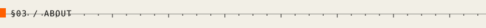
</picture>

`about.md · utf-8 · lf · last edited 2026-10-08`

<table>
<tr>
<td width="140" valign="top">
<picture>
  <source media="(prefers-color-scheme: dark)" srcset="assets/avatar-dark.svg"/>
  
</picture>
</td>
<td valign="top">

I'm Nishanth. I build LLM systems that have to be right, then the boring code that keeps them right.

Final-year CS at Bangalore Institute of Technology (IoT / cybersecurity / blockchain, CGPA 8.50). AI/ML intern at Kwilo AI since April 2026 — answer-script grading and the product around it.

I don't pick a lane. I pick a problem and learn whatever stack it lives in: 100+ CTFs, vision-LLM eval harnesses, LangGraph agents, Postgres RLS, even servo trigonometry for a face-tracking water gun.

Currently: shipping ERP and AI at Kwilo, probing emotion out of 826 Hindi clips, 290 LeetCode (253 in Java).

Off the clock: Lazy Monks (10+ hackathons, 3rd at BuzzOnEarth @ IIT Kanpur), first at Turing Much, core member of cryptX.

<br/>

**based in** Bengaluru · **graduating** Jul 2027 · **CGPA** 8.50 / 10 · **LeetCode** 290 · **TryHackMe** top 2% · **certs** OCI GenAI Pro, APIsec ACP

</td>
</tr>
</table>

---

<a id="skills"></a>

## Skills

### `$ skills`

<picture>
  <source media="(prefers-color-scheme: dark)" srcset="assets/div-skills-dark.svg"/>
  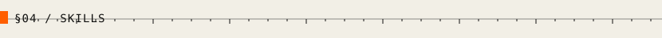
</picture>

<sub><i>← the empty skills cell is deliberate. honest beats exhaustive</i></sub>

no logo wall. you can't grep a logo.

| domain | daily | comfortable | dabbling |
| --- | --- | --- | --- |
| **LLMs & agents** | few-shot prompts, Gemini / Vertex, Azure OpenAI, eval harnesses | LangGraph, LangChain, RAG + pgvector, Bedrock | Sarvam AI, Claude API |
| **Models & data** | pandas, NumPy | PyTorch, scikit-learn, Whisper / w2v-BERT, matplotlib | TensorFlow, OpenCV, MediaPipe, federated learning |
| **Backend** | FastAPI, SQLAlchemy async, PostgreSQL, Alembic, pytest | Flask, Spring Boot, WebSockets, Postgres RLS | Supabase, Firebase, Prisma |
| **Frontend** | React, TanStack Query | Tailwind, Vite, React Native, vitest | Next.js, Phaser |
| **MLOps & cloud** | Git, Docker, GitHub Actions | GCP Cloud Run + GCS, Kaggle GPU, uv | Azure Container Apps, AWS EC2 / S3, Cloudflare |
| **Languages** | Python, TypeScript | Java, SQL, Bash | C, C++, Rust (Soroban) |
| **Security** | — (was daily in 2025) | Burp Suite, nmap, OWASP Top 10, API security | sqlmap, Scapy, Web Crypto |

---

## One number

<picture>
  <source media="(prefers-color-scheme: dark)" srcset="assets/stat-mae-dark.svg"/>
  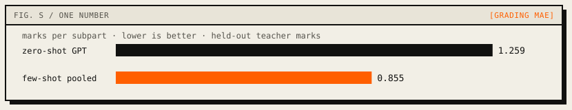
</picture>

<sub><i>← 0.855 MAE = usually off by less than one mark</i></sub>

---

<a id="contact"></a>

## Contact

<picture>
  <source media="(prefers-color-scheme: dark)" srcset="assets/div-contact-dark.svg"/>
  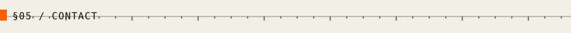
</picture>

<picture>
  <source media="(prefers-color-scheme: dark)" srcset="assets/contact-dark.svg"/>
  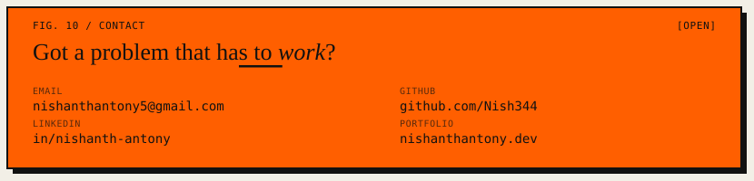
</picture>

```
mailto:nishanthantony5@gmail.com
```

[`email`](mailto:nishanthantony5@gmail.com) · [`github`](https://github.com/Nish344) · [`linkedin`](https://www.linkedin.com/in/nishanth-antony-b60110289/) · [`leetcode`](https://leetcode.com/u/Nish345/) · [`resume`](https://nishanthantony.dev/resume.pdf) · [`portfolio`](https://nishanthantony.dev/)

---

**Colophon.** Set in Instrument Serif (outlined) and JetBrains Mono. Assets generated from `data.json` — no template, no badge soup, no visitor counter. The orange is `#FF5F00` and it is rationed.

© 2026 Nishanth Antony · last updated 2026-10-08 · [`cd ~`](https://nishanthantony.dev/)
