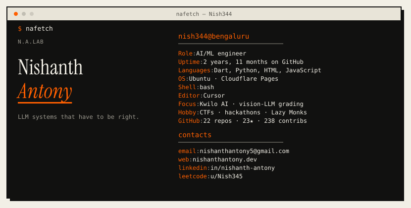

<!--
  nafetch profile — python3 scripts/generate.py
  Palette: #F2EFE6 / #111110 / #FF5F00
-->

<picture>
  <source media="(prefers-color-scheme: dark)" srcset="assets/nafetch-dark.svg"/>
  
</picture>

  <a href="https://nishanthantony.dev/">portfolio</a>
  ·
  <a href="https://github.com/Nish344">github</a>
  ·
  <a href="https://www.linkedin.com/in/nishanth-antony-b60110289/">linkedin</a>
  ·
  <a href="https://leetcode.com/u/Nish345/">leetcode</a>
  ·
  <a href="https://nishanthantony.dev/resume.pdf">resume</a>
  ·
  <a href="mailto:nishanthantony5@gmail.com">email</a>

Updated 2026-10-08 · 235 contributions this year · orange is <code>#FF5F00</code>

