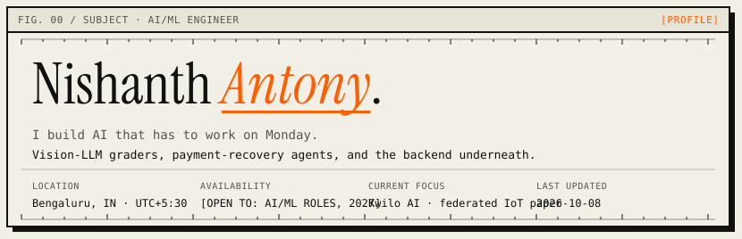

<!--
  Generated from data.json — run: python3 scripts/generate.py
  Palette matches https://nishanthantony.dev/  (#F2EFE6 / #111110 / #FF5F00)
-->

<picture>
  <source media="(prefers-color-scheme: dark)" srcset="assets/banner-dark.svg"/>
  
</picture>

<p align="center">
  <a href="https://nishanthantony.dev/"><strong>nishanthantony.dev</strong></a>
  &nbsp;·&nbsp; Bengaluru
  &nbsp;·&nbsp; open to AI/ML roles, 2027
  &nbsp;·&nbsp; <a href="https://nishanthantony.dev/resume.pdf">resume</a>
</p>

<p align="center">
  <a href="#selected-work"><code>work</code></a>
  &nbsp;
  <a href="#about"><code>about</code></a>
  &nbsp;
  <a href="#skills"><code>skills</code></a>
  &nbsp;
  <a href="#lab-log"><code>lab log</code></a>
  &nbsp;
  <a href="#contact"><code>contact</code></a>
</p>

---

## Selected work

AI that has to ship — graders, recovery agents, and the product underneath.
Pipelines and diagrams live on the [portfolio](https://nishanthantony.dev/).

### Vision-LLM exam grader
`SHIPPED` · Kwilo AI · production research

Marking handwritten university scripts eats teachers' evenings; a model two marks off per subpart is worse than no model.

**Result.** **0.855** pooled MAE (marks/subpart) · **−28%** error vs zero-shot GPT · **81.7%** within ±1 of teacher

`python` `azure openai` `vertex ai` `pymupdf` `uv` `matplotlib`

[portfolio write-up](https://nishanthantony.dev/#p-grader)

<sub>Exemplars beat model size: few-shot Flash (0.890) beat zero-shot Pro (1.195). A harness that writes run manifests beats any single prompt tweak.</sub>

---

### PayRecover
`SHIPPED` · Razorpay AI Buildathon · track 03

A failed UPI or card payment can't be silently re-charged. Merchants either spam the customer or lose the sale.

**Result.** **31.3%** failed revenue recovered · **76.1%** recoverable customers · **80** seeded dry-run cases

`python` `razorpay api` `gemini` `sqlite` `pytest`

[repo](https://github.com/Nish344/payrecover-agent) · [demo video](https://www.youtube.com/watch?v=ZIid1JJSooE)

<sub>The model call is the easy 10%. The agent is the policy around it: typed timeouts, writes that can't double-fire, a stop that stays stopped.</sub>

---

### Shipping on an AI learning platform
`IN PROD` · Kwilo AI · Apr–May, Jul 2026–now

Schools run exams, fees and admissions here — a bug costs real money or leaks a parent's phone number.

**Result.** **0** uploads blocked by OCR · **5** product areas shipped · **2** guardians / admission

`fastapi` `sqlalchemy async` `postgres + RLS` `alembic` `react 19` `tanstack query`

[kwilo.ai](https://kwilo.ai)

<sub>A self-reported phone number is not proof of identity. Lock the row before two payments settle the same installment milliseconds apart.</sub>

---

### Federated IoT anomaly detector
`RESEARCH` · IoT security · paper on the way

IoT intrusion detection usually means shipping raw traffic from every camera and sensor to one server — a privacy and bandwidth problem.

**Result.** **0.98** aggregated AUC (FedProx) · **3** device classes · **0** raw packets leaving client

`python` `pytorch` `docker` `fedprox` `scikit-learn`

[progress report](https://nishanthantony.dev/fediot-progress.pdf)

<sub>Most 'model instability' was a data-partitioning bug. Check the shards before you tune the optimizer.</sub>


### Also

| project | status | highlight | links |
| --- | --- | --- | --- |
| Samudra Prahari | `SIH 2025` | **0** internet to file (BLE) — When a coastal hazard hits, the network goes first — and reports that get… | [source](https://github.com/nikhil-r0/samudra-prahari-ecosystem) · [demo video](https://www.youtube.com/watch?v=5G5odwkGp0A) |
| Veris truth engine | `HACKATHON` | **5** graph nodes — Claims spread faster than anyone can check who started them or who is… | [repo](https://github.com/nikhil-r0/veris-ecosystem) · [demo video](https://www.youtube.com/watch?v=OmviNm0HJbg&t=1s) |

---

## About

I'm Nishanth. I build LLM systems that have to be right, then the boring code that keeps them right.

Final-year CS at Bangalore Institute of Technology (IoT / cybersecurity / blockchain, CGPA 8.50). AI/ML intern at Kwilo AI since April 2026 — answer-script grading and the product around it.

I don't pick a lane. I pick a problem and learn whatever stack it lives in: 100+ CTFs, vision-LLM eval harnesses, LangGraph agents, Postgres RLS, even servo trigonometry for a face-tracking water gun.

Currently: shipping ERP and AI at Kwilo, probing emotion out of 826 Hindi clips, 290 LeetCode (253 in Java).

**based in** Bengaluru · **graduating** Jul 2027 · **CGPA** 8.50 / 10 · **LeetCode** 290 · **TryHackMe** top 2% · **certs** OCI GenAI Pro, APIsec ACP

---

## Skills

No logo wall. Honest labels: *daily* = used this week; *comfortable* = shipped without docs for basics.

| domain | daily | comfortable |
| --- | --- | --- |
| **LLMs & agents** | few-shot prompts, Gemini / Vertex, Azure OpenAI, eval harnesses | LangGraph, LangChain, RAG + pgvector, Bedrock |
| **Models & data** | pandas, NumPy | PyTorch, scikit-learn, Whisper / w2v-BERT, matplotlib |
| **Backend** | FastAPI, SQLAlchemy async, PostgreSQL, Alembic, pytest | Flask, Spring Boot, WebSockets, Postgres RLS |
| **Frontend** | React, TanStack Query | Tailwind, Vite, React Native, vitest |
| **MLOps & cloud** | Git, Docker, GitHub Actions | GCP Cloud Run + GCS, Kaggle GPU, uv |
| **Languages** | Python, TypeScript | Java, SQL, Bash |
| **Security** | — (was daily in 2025) | Burp Suite, nmap, OWASP Top 10, API security |

<details>
<summary>dabbling</summary>

**LLMs & agents** — Sarvam AI, Claude API; **Models & data** — TensorFlow, OpenCV, MediaPipe, federated learning; **Backend** — Supabase, Firebase, Prisma; **Frontend** — Next.js, Phaser; **MLOps & cloud** — Azure Container Apps, AWS EC2 / S3, Cloudflare; **Languages** — C, C++, Rust (Soroban); **Security** — sqlmap, Scapy, Web Crypto

</details>

---

## Lab log

Smaller experiments — including the ones that didn't work.

| date | entry | tag | result |
| --- | --- | --- | --- |
| `2026-10` | w2v-BERT 2.0 vs Whisper-large encoders | `ML` | OOF `0.9346`, best so far. public LB didn't move; private split did. |
| `2026-09` | Fine-tuning Whisper-large on 826 clips | `ML` | lost to frozen probe, `0.904` vs `0.925`. overfits by epoch 5. |
| `2026-09` | Face-tracking water gun | `IOT` | MediaPipe face centre → pan/tilt → two ESP32 servos. shoot is still a stub. |
| `2026-07` | AssetFlow, 8-hour hackathon | `HACK` | owned asset track: registry, allocation state machine, transfers, overdue flagger. |
| `2026-05` | Gemini 3.1 Pro vs 3 Flash, zero-shot grading | `EVAL` | Flash wins File Structures by `0.42` MAE, loses Math by `0.54`. |
| `2026-05` | Sarvam document OCR as grading front-end | `EVAL` | benchmarked, then removed. documented why so nobody re-tries it blind. |
| `2026-04` | Kannada name generator, char-level GRU | `ML` | loss `2.08` → `1.41` over 10k epochs. mostly merely plausible. |
| `2025-12` | OWASP Top 10 lab series | `SEC` | `17/17` PortSwigger labs written up. README updates via Actions. |

---

## Contact

```
mailto:nishanthantony5@gmail.com
```

[nishanthantony5@gmail.com](mailto:nishanthantony5@gmail.com)
· [GitHub](https://github.com/Nish344)
· [LinkedIn](https://www.linkedin.com/in/nishanth-antony-b60110289/)
· [LeetCode](https://leetcode.com/u/Nish345/)
· [portfolio](https://nishanthantony.dev/)
· [resume](https://nishanthantony.dev/resume.pdf)

---

<sub>
Same paper / ink / orange as <a href="https://nishanthantony.dev/">nishanthantony.dev</a>.
Banner outlined in Instrument Serif; body is Markdown on purpose.
© 2026 Nishanth Antony · updated 2026-10-08
</sub>
